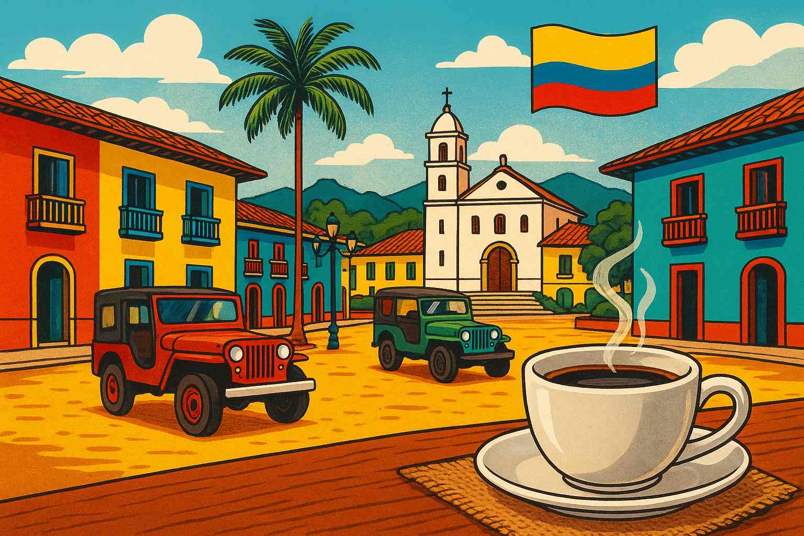

# 🖼️ WebP Implementation Guide for Caffeine Cartel

## 📊 Current Image Issues (699 KiB savings available):
- Caffeine Cartel Logo: 227.6 KiB → could be 56.9 KiB (225.2 KiB saved)
- Blog thumbnails: 146.5 KiB → could be 10 KiB (136.5 KiB saved)
- Images oversized for display dimensions

## 🛠️ Step-by-Step Fix:

### Step 1: Optimize Images
1. Open `optimize-images.html` in your browser
2. Upload your blog thumbnail images
3. Set quality to 85% (good balance of size/quality)
4. Download the optimized WebP versions
5. Save them in your `Images` folder

### Step 2: Update HTML with WebP + Fallback

#### Before (Current):
```html

```

#### After (Optimized):
```html
<picture>
    <source srcset="Images/Blog-Thumbnail-Starbucks-Devil.webp" type="image/webp">
    
</picture>
```

### Step 3: Specific Files to Update

#### 1. Logo Images:
```html
<!-- Header Logo -->
<picture>
    <source srcset="Images/Caffeine-Cartel-Vintage-Emblem-transparent.webp" type="image/webp">
    
</picture>
```

#### 2. Blog Thumbnails:
```html
<!-- Starbucks Blog -->
<picture>
    <source srcset="Images/Blog-Thumbnail-Starbucks-Devil.webp" type="image/webp">
    
</picture>

<!-- Coffee Machines Blog -->
<picture>
    <source srcset="Images/Coffee-Thumbnail-What-Machine-to-Buy.webp" type="image/webp">
    
</picture>

<!-- Edinburgh Coffee Blog -->
<picture>
    <source srcset="Images/Edinburgh-Coffee-Blog-Image.webp" type="image/webp">
    
</picture>

<!-- Science of Coffee Blog -->
<picture>
    <source srcset="Images/Science-of-coffee-image.webp" type="image/webp">
    
</picture>

<!-- Salento Coffee Blog -->
<picture>
    <source srcset="Images/salento-main.webp" type="image/webp">
    
</picture>
```

### Step 4: Recommended Image Sizes

| Image Type | Recommended Size | Current Size | Target Size |
|------------|------------------|--------------|-------------|
| Blog Thumbnails | 400x300px | ~150KB | ~15KB |
| Featured Images | 800x600px | ~200KB | ~30KB |
| Logo Images | 200x200px | ~230KB | ~20KB |

### Step 5: Quality Settings

- **Blog Thumbnails**: 80-85% quality
- **Featured Images**: 85-90% quality  
- **Logo Images**: 90-95% quality (need crisp text)

## 🚀 Expected Results:

After implementing WebP:
- **699 KiB total savings** (as shown in audit)
- **60-80% file size reduction** per image
- **Faster page load times**
- **Better Core Web Vitals scores**
- **Improved mobile performance**

## 🔧 Alternative Quick Fix (CSS):

If you can't convert to WebP immediately, add this CSS to resize images:

```css
/* Optimize image sizes */
.blog-image img,
.featured-image img,
.post-featured-image img {
    max-width: 100%;
    height: auto;
    object-fit: cover;
}

/* Specific size limits */
.header-logo {
    max-width: 200px;
    height: auto;
}

.blog-card .blog-image img {
    max-width: 400px;
    max-height: 300px;
    object-fit: cover;
}
```

## 📱 Mobile-Specific Optimizations:

```html
<picture>
    <source media="(max-width: 768px)" srcset="Images/blog-thumb-mobile.webp" type="image/webp">
    <source media="(max-width: 768px)" srcset="Images/blog-thumb-mobile.jpg">
    <source srcset="Images/blog-thumb-desktop.webp" type="image/webp">
    
</picture>
```

## ✅ Priority Order:

1. **High Priority**: Logo images (most used)
2. **Medium Priority**: Featured blog images (LCP elements)
3. **Low Priority**: Content images (lazy loaded)

Start with the logo and main blog thumbnails for maximum impact!
